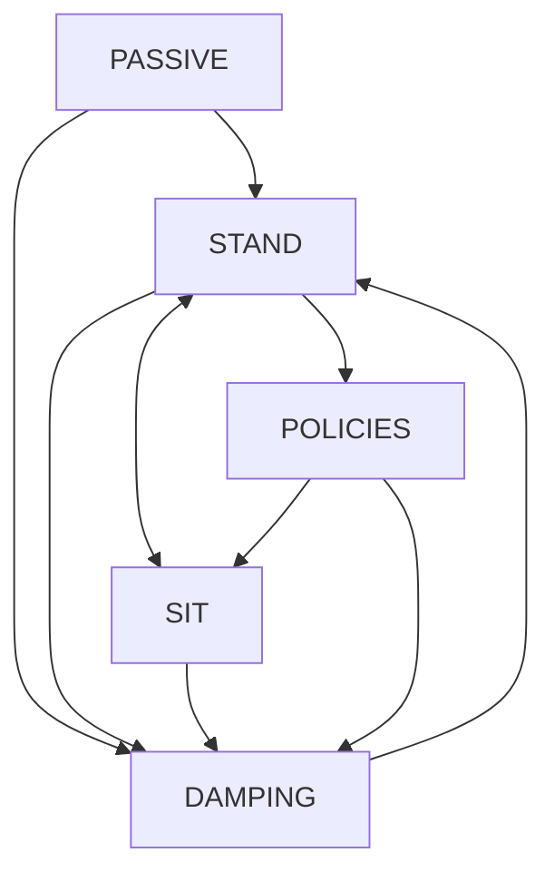

# Sirius RL Gym & Deployment

**This repository include RL training & sim2sim & sim2real demo about sirius.**

<table style="width: 100%; border-collapse: collapse; margin: -5px -0px -0px 0px;">
    <tr>
        <td align="center" style="width: 24%; padding: 2px;">
            <br/>
            <span style="font-size: 0.9em;">IsaacGym</span>
        </td>
        <td align="center" style="width: 24%; padding: 2px;">
            <br/>
            <span style="font-size: 0.9em;">MuJoCo</span>
        </td>
        <td align="center" style="width: 24%; padding: 2px;">
            <br/>
            <span style="font-size: 0.9em;">RealWorld</span>
        </td>
    </tr>
</table>


This repo. has been tested on:
- Ubuntu 22.04 LTS  
- ROS 2 Humble

## Docker
To get started quickly, run this project in a Docker container. See [docker.md](./doc/docker.md) for details.


## Installation

For the installation guide of training pipeline, please refer to [install.md](./doc/install.md).


## Overview

The basic workflow for using reinforcement learning to achieve motion control is:

- **Train the policy in Isaac Gym**: Use the legged_gym to train the policy through robot-environment interaction.
- **Sim2Sim in MuJoCo**: Validate the trained policy in MuJoCo to ensure it generalizes beyond the legged_gym.
- **Sim2Real**: Deploy the policy to a physical robot to achieve motion control.


## 1. RL training

### 1.1 Train

```python
# A joystick policy demo
cd legged_gym
python legged_gym/scripts/train.py --task=sirius --headless
```

### 1.2 Play

```python
python legged_gym/scripts/play.py --task=sirius
```

### 1.3 Export JIT Model

```python
python legged_gym/scripts/export_JIT_model.py --task=sirius --model_path=<path/to/model>
# eg: python legged_gym/scripts/export_JIT_model.py --task=sirius --model_path=./logs/sirius_diff_release/Jun12_18-48-39_/model_300.pt
# The model will be saved as [policy.jit] in the same directory as the .pt model.
```

## 2. Sim2Sim

We demonstrate a sim2sim environment based on [MuJoCo](https://github.com/google-deepmind/mujoco) and **ROS2 topic**.

### 2.1 Build

Denpendencies: 

- ROS2
- LCM: 
```bash
sudo apt install liblcm-dev
```
- iceoryx (v2.95.4): https://github.com/eclipse-iceoryx/iceoryx/tree/v2.95.4

```bash
# The source code is already included in this repository.
cd deploy/iceoryx
```
For detailed installation instructions, please refer to the [installation guide](https://github.com/eclipse-iceoryx/iceoryx/blob/v2.95.4/doc/website/getting-started/installation.md).

Then build:

```bash
cd deploy/sim2sim
colcon build
```

### 2.2 Run Simulator

```bash
# In current terminal
cd deploy/sim2sim/scripts
bash ./launch_simulator.sh

# Open another terminal
cd deploy/sim2sim
source install/setup.bash
cd scripts
bash ./launch_ros2topic.sh
```

### 2.3 Enter Secondary Development Mode

1. When you boot up the simulator, the robot dog will automaticlly stand.
2. Press `LB + ↓` to enter SITDOWN mode.
3. Press `LB + ←` to enter PASSIVE mode.
4. Choose different safety level USER_INTERFACE mode.
   - `↑ + RO` (the small right-top button) = USER_INTERFACE_HIGH (No torque limit).
   - `← + RO` (the small right-top button) = USER_INTERFACE_MIDDLE (Max torque 30Nm).
   - `↓ + RO` (the small right-top button) = USER_INTERFACE_LOW (Max torque 20Nm).

```markdown
# Safe level: 

USER_INTERFACE_LOW > USER_INTERFACE_MIDDLE > USER_INTERFACE_HIGH
    (Safe)             ----------->                (Unsafe)
```


### 2.4 Run Policy

```bash
# Note: for ROS2 topic communicate sucessfully, you may need to run policy as root.
cd deploy/ros2_RL_controller
colcon build
source install/setup.bash
ros2 run RL_controller joystick
```

### 2.5 Demo Joystick Control
```markdown
RB + Y -> STAND
RB + A -> SIT
RB + X -> RL POLICY
RB + B -> DAMPING

Use left stick to move forward/backward and left/right
Use right stick to rotate (turn left/right)
```



## 3. Sim2Real

### 3.1 Enter Secondary Development Mode

0. Follow the user guide to boot up the robot dog.
1. The robot dog will automatically stand after booting.
2. Press `LB + ↓` to enter SITDOWN mode.
3. Press `LB + ←` to enter PASSIVE mode.
4. Choose different safety level USER_INTERFACE mode.
   - `↑ + RO` (the small right-top button) = USER_INTERFACE_HIGH (No torque limit).
   - `← + RO` (the small right-top button) = USER_INTERFACE_MIDDLE (Max torque 30Nm).
   - `↓ + RO` (the small right-top button) = USER_INTERFACE_LOW (Max torque 20Nm).

```markdown
# Safe level: 

USER_INTERFACE_LOW > USER_INTERFACE_MIDDLE > USER_INTERFACE_HIGH
    (Safe)             ----------->                (Unsafe)
```
> Note:
> For safety reasons, we recommend starting with USER_INTERFACE_LOW when deploying a new policy for the first time.


### 3.2 Wired to Robot Dog
```bash
# First set your PC Ip address as 192.168.123.xxx, netmask as 255.255.255.0
ssh cuhk@192.168.123.28 # passwd: 1
# or cuhk@192.168.123.29
```

And the following operation is on robot dog:

### 3.3 Build
```bash
# Please transfer the ros2_RL_controller folder to the robot dog via scp before proceeding.
cd deploy/ros2_RL_controller
colcon build
```

### 3.4 Safety Notice

Before running the RL policy, we recommend verifying that the content of the ROS2 topic /ROS2_Robot_State is actively updating. The topic's content is only updated when the robot is in USER_INTERFACE mode.

Additionally, for safety, if the robot exits USER_INTERFACE mode while the RL policy is running, you must restart the robot before proceeding.

### 3.5 Run
```bash
source install/setup.bash
ros2 run RL_controller joystick
```
Then you can control the robot dog using the joystick as described in Section 2.5.

Please be cautious when using this policy in the real world, as it is only a demo and has not been fully fine-tuned.

## 4. Deploy Your Own Code & Policy on the Real Robot

We highly recommend that you first run through our complete demo process to become familiar with the entire pipeline.

When writing your own deployment code, you can subscribe to the following two ROS 2 topics:

-  **/ROS2_Robot_State**: Used to obtain the robot's state. For detailed message format, please refer to  [RobotState.msg](deploy/ros2_RL_controller/src/robot_interface/msg/RobotState.msg)
- **/joy**: Used to obtain joystick input. For detailed message format, please refer to [joy](https://index.ros.org/p/joy/)

You also need to publish to the following ROS 2 topic:

- **/RobotCMD**: Used to send actions to the robot dog. For detailed message format, please refer to [RobotCMD.msg](deploy/ros2_RL_controller/src/robot_interface/msg/RobotCMD.msg)

It should be noted that the content of the /ROS2_Robot_State and /RobotCMD topics will only be updated when you are in the USER_INTERFACE mode. 

**Additionally, you should always verify your policy in sim2sim first.**

## 5. Some Notes

```markdown
# Observations order in ROS2 topic /ROS2_Robot_State

The quat order: w x y z

The joint order:

"RF_HAA", "RF_HFE", "RF_KFE"  right front leg
"LF_HAA", "LF_HFE", "LF_KFE" left front leg
"RH_HAA", "RH_HFE", "RH_KFE" right rear leg
"LH_HAA", "LH_HFE", "LH_KFE" left rear leg

# The joint order in the ROS2 topic /RobotCMD is the same as above.
```

The RL policy may use a different joint order, so you may need to reorder the data when handling observations and sending commands.

The joint position and velocity arrays in both /ROS2_Robot_State and /RobotCMD have a length of 18. However, you only need to use the first 12 joints. When publishing to the /RobotCMD topic, please ensure that the position and velocity values for the remaining joints are set to zero.


## Acknowledgments

This repository is built upon the support and contributions of the following open-source projects. Special thanks to:

- [legged\_gym](https://github.com/leggedrobotics/legged_gym)
- [rsl\_rl](https://github.com/leggedrobotics/rsl_rl.git)
- [mujoco](https://github.com/google-deepmind/mujoco.git)
- [lcm](https://github.com/lcm-proj/lcm)
- [iceoryx](https://github.com/eclipse-iceoryx/iceoryx/tree/main)
