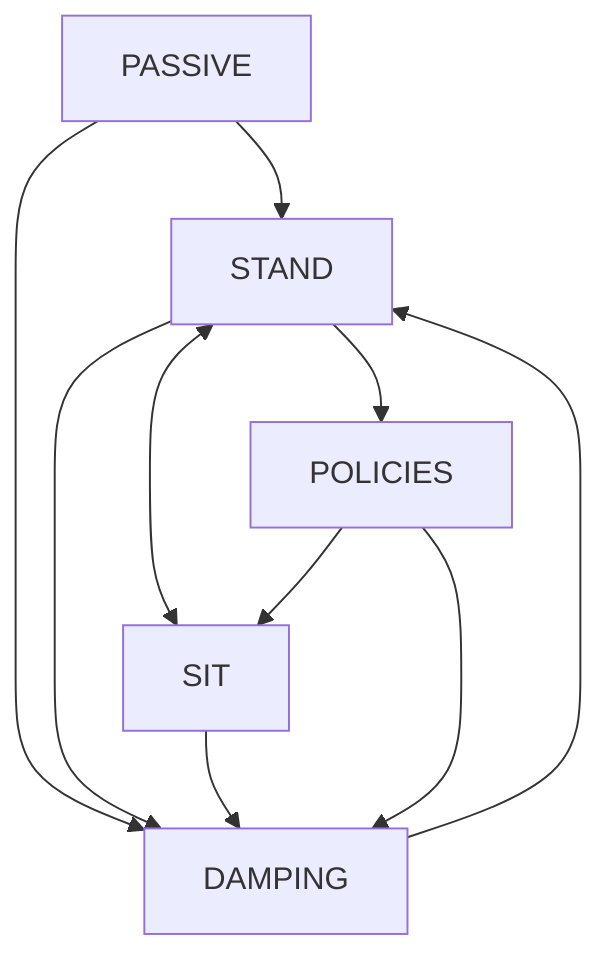

# Quadruped RL Bridge Crossing

Train a quadruped robot to walk across a bridge of stepping-stone pillars with 5–15 cm gaps using reinforcement learning, then deploy the policy to hardware via ROS 2.

<table style="width:100%; border-collapse:collapse;">
  <tr>
    <td align="center" style="width:50%; padding:6px;">
      <video src="https://github.com/user-attachments/assets/14f189ec-f1cd-4f6e-b9d7-7a6b08d42338" controls autoplay muted loop style="width:100%; max-height:240px; object-fit:cover;"></video><br/>
      <b>Sirius</b> — Bridge Crossing (Sim2Real)
    </td>
    <td align="center" style="width:50%; padding:6px;">
      <video src="https://github.com/user-attachments/assets/92e631aa-9938-43d7-a2d8-54ee4238705f" controls autoplay muted loop style="width:100%; max-height:240px; object-fit:cover;"></video><br/>
      <b>Go1</b> — Emergent Tripod Gait (Failure Case)
    </td>
  </tr>
</table>

## My Contributions

Built on top of [legged\_gym](https://github.com/leggedrobotics/legged_gym) (ETH Zurich) and [rsl\_rl](https://github.com/leggedrobotics/rsl_rl). The following were designed and implemented from scratch:

### 1. Bridge Environment

A custom `bridge` terrain type procedurally generates a row of pillars for each of the 4096 parallel training environments:

- **Start platform**: 1 m × 1 m
- **10 stepping-stone pillars**: each 0.25 m wide (x) × 1 m wide (y), separated by randomized gaps
- **End platform**: 1 m × 1 m

All geometry per environment is batched into a single triangle mesh. Pillar layouts are regenerated per-environment and per-episode reset, so the policy cannot memorize a fixed sequence.

### 2. Pillar-Aware Observation Space (64 dims)

Standard legged robot observations are extended with **16 dims of pillar geometry** — the top-corner (x, z) coordinates of the next two upcoming pillars, expressed in the robot's body frame. This gives the policy spatial awareness of its immediate stepping targets without any exteroceptive sensors (no camera, no lidar).

| Observation | Dims |
|---|:---:|
| Base linear / angular velocity | 6 |
| Projected gravity | 3 |
| Velocity commands | 3 |
| Joint positions (offset from default) | 12 |
| Joint velocities | 12 |
| Previous actions | 12 |
| **Next 2 pillar top corners (x, z in body frame)** | **16** |
| **Total** | **64** |

### 3. Reward Engineering

Custom reward terms added for the bridge task:

| Term | Sign | Purpose |
|---|:---:|---|
| `tracking_lin_vel` | + | Track commanded forward velocity (primary) |
| `foot_in_gap` | − | Penalize foot z-position below pillar top surface |
| `forward_progress` | + | Continuous progress reward + one-time milestone bonuses every 1 m |
| `goal_reached` | + | Large bonus when robot clears the end platform |
| `lateral_deviation` | − | Penalize drift from bridge centerline |
| `heading_alignment` | − | Penalize yaw deviation from forward direction |
| `knee_contact` | − | Penalize any non-foot body contact with the environment |
| `stand_still` | − | Penalize near-zero velocity (prevents the policy from freezing) |
| `posture` | + | Encourage joint angles close to default pose |
| `feet_air_time` | + | Encourage active stepping gait |

### 4. Curriculum Learning

Gap range starts at 5 cm and expands toward 15 cm based on per-environment performance. Each episode reset checks how far the robot traveled:
- **Gap increases** when robot travels > 3.5 m (success)
- **Gap decreases** when robot fails within < 0.4 m (too hard)

### 5. Interesting Failure: Go1 Tripod Gait

When training on the Unitree Go1 (Go1 branch), the policy converged to an unexpected solution: a trembling tripod stance where the robot balances on three legs and barely moves. This is reward hacking — the policy found a local optimum that avoids the `foot_in_gap` penalty by minimizing foot movement, at the cost of forward progress. Shown above as an instructive failure case.

---

# Original Project: Sirius RL Gym & Deployment

**This repository includes RL training, sim2sim, and sim2real deployment for Sirius.**

<table style="width: 100%; border-collapse: collapse; margin: -5px -0px -0px 0px;">
    <tr>
        <td align="center" style="width: 24%; padding: 2px;">
            <br/>
            <span style="font-size: 0.9em;">IsaacGym</span>
        </td>
        <td align="center" style="width: 24%; padding: 2px;">
            <br/>
            <span style="font-size: 0.9em;">MuJoCo</span>
        </td>
        <td align="center" style="width: 24%; padding: 2px;">
            <br/>
            <span style="font-size: 0.9em;">RealWorld</span>
        </td>
    </tr>
</table>

Tested on:
- Ubuntu 22.04 LTS
- ROS 2 Humble

## Docker

To get started quickly, run this project in a Docker container. See [docker.md](./doc/docker.md) for details.

## Installation

For the installation guide of the training pipeline, please refer to [install.md](./doc/install.md).

## Overview

The basic workflow for using reinforcement learning to achieve motion control is:

- **Train the policy in Isaac Gym**: Use legged_gym to train the policy through robot-environment interaction.
- **Sim2Sim in MuJoCo**: Validate the trained policy in MuJoCo to ensure it generalizes beyond Isaac Gym.
- **Sim2Real**: Deploy the policy to a physical robot.

## 1. RL Training

### 1.1 Train

```bash
cd legged_gym
python legged_gym/scripts/train.py --task=sirius --headless
```

### 1.2 Play

```bash
python legged_gym/scripts/play.py --task=sirius
```

### 1.3 Export JIT Model

```bash
python legged_gym/scripts/export_JIT_model.py --task=sirius --model_path=<path/to/model>
# e.g.: python legged_gym/scripts/export_JIT_model.py --task=sirius --model_path=./logs/sirius_diff_release/Jun12_18-48-39_/model_300.pt
# The model will be saved as [policy.jit] in the same directory as the .pt model.
```

## 2. Sim2Sim

We demonstrate a sim2sim environment based on [MuJoCo](https://github.com/google-deepmind/mujoco) and **ROS 2 topics**.

### 2.1 Build

Dependencies:

- ROS 2
- LCM:
```bash
sudo apt install liblcm-dev
```
- iceoryx (v2.95.4): https://github.com/eclipse-iceoryx/iceoryx/tree/v2.95.4

```bash
# The source code is already included in this repository.
cd deploy/iceoryx
```

For detailed installation instructions, please refer to the [installation guide](https://github.com/eclipse-iceoryx/iceoryx/blob/v2.95.4/doc/website/getting-started/installation.md).

Then build:

```bash
cd deploy/sim2sim
colcon build
```

### 2.2 Run Simulator

```bash
# In current terminal
cd deploy/sim2sim/scripts
bash ./launch_simulator.sh

# Open another terminal
cd deploy/sim2sim
source install/setup.bash
cd scripts
bash ./launch_ros2topic.sh
```

### 2.3 Enter Secondary Development Mode

1. When you boot up the simulator, the robot dog will automatically stand.
2. Press `LB + ↓` to enter SITDOWN mode.
3. Press `LB + ←` to enter PASSIVE mode.
4. Choose a safety level USER_INTERFACE mode:
   - `↑ + RO` = USER_INTERFACE_HIGH (no torque limit)
   - `← + RO` = USER_INTERFACE_MIDDLE (max torque 30 Nm)
   - `↓ + RO` = USER_INTERFACE_LOW (max torque 20 Nm)

```
Safety level:  USER_INTERFACE_LOW  >  USER_INTERFACE_MIDDLE  >  USER_INTERFACE_HIGH
                   (Safest)                                          (Least safe)
```

### 2.4 Run Policy

```bash
# Note: for ROS 2 topic communication to work, you may need to run the policy as root.
cd deploy/ros2_RL_controller
colcon build
source install/setup.bash
ros2 run RL_controller joystick
```

### 2.5 Joystick Control

```
RB + Y  →  STAND
RB + A  →  SIT
RB + X  →  RL POLICY
RB + B  →  DAMPING

Left stick   →  forward / backward / strafe
Right stick  →  rotate (yaw)
```


```mermaid
graph TD;
    PASSIVE-->STAND;
    STAND<-->SIT;
    STAND-->POLICIES;
    POLICIES-->SIT;
    PASSIVE-->DAMPING;
    STAND-->DAMPING;
    SIT-->DAMPING;
    POLICIES-->DAMPING;
    DAMPING-->STAND
```

## 3. Sim2Real

### 3.1 Enter Secondary Development Mode

0. Follow the user guide to boot up the robot.
1. The robot will automatically stand after booting.
2. Press `LB + ↓` to enter SITDOWN mode.
3. Press `LB + ←` to enter PASSIVE mode.
4. Choose a safety level (same as Sim2Sim, Section 2.3).

> For safety, start with USER_INTERFACE_LOW when deploying a new policy for the first time.

### 3.2 Connect to Robot

```bash
# Set your PC IP to 192.168.123.xxx, netmask 255.255.255.0
ssh cuhk@192.168.123.28  # password: 1
# or cuhk@192.168.123.29
```

### 3.3 Build

```bash
# Transfer ros2_RL_controller to the robot via scp before proceeding.
cd deploy/ros2_RL_controller
colcon build
```

### 3.4 Safety Notice

Before running the RL policy, verify that `/ROS2_Robot_State` is actively updating. The topic is only updated when the robot is in USER_INTERFACE mode.

If the robot exits USER_INTERFACE mode while the RL policy is running, restart the robot before proceeding.

### 3.5 Run

```bash
source install/setup.bash
ros2 run RL_controller joystick
```

Control with the joystick as described in Section 2.5.

## 4. Deploy Your Own Code & Policy

We recommend running the complete demo first to become familiar with the pipeline.

Subscribe to these ROS 2 topics for robot state and input:
- `/ROS2_Robot_State` — robot state ([RobotState.msg](deploy/ros2_RL_controller/src/robot_interface/msg/RobotState.msg))
- `/joy` — joystick input ([joy](https://index.ros.org/p/joy/))

Publish to:
- `/RobotCMD` — action commands ([RobotCMD.msg](deploy/ros2_RL_controller/src/robot_interface/msg/RobotCMD.msg))

These topics are only active in USER_INTERFACE mode. **Always validate in sim2sim before deploying to hardware.**

## 5. Notes

```
Observation order in /ROS2_Robot_State:

Quaternion order: w x y z

Joint order:
  "RF_HAA", "RF_HFE", "RF_KFE"   right front
  "LF_HAA", "LF_HFE", "LF_KFE"   left front
  "RH_HAA", "RH_HFE", "RH_KFE"   right rear
  "LH_HAA", "LH_HFE", "LH_KFE"   left rear

The joint order in /RobotCMD is the same.
```

The RL policy may use a different joint order; reorder observations and commands accordingly.

Both `/ROS2_Robot_State` and `/RobotCMD` have arrays of length 18. Only the first 12 joints are used — set the remaining position and velocity values to zero when publishing.

## Acknowledgments

- [legged\_gym](https://github.com/leggedrobotics/legged_gym)
- [rsl\_rl](https://github.com/leggedrobotics/rsl_rl)
- [mujoco](https://github.com/google-deepmind/mujoco)
- [lcm](https://github.com/lcm-proj/lcm)
- [iceoryx](https://github.com/eclipse-iceoryx/iceoryx/tree/main)
